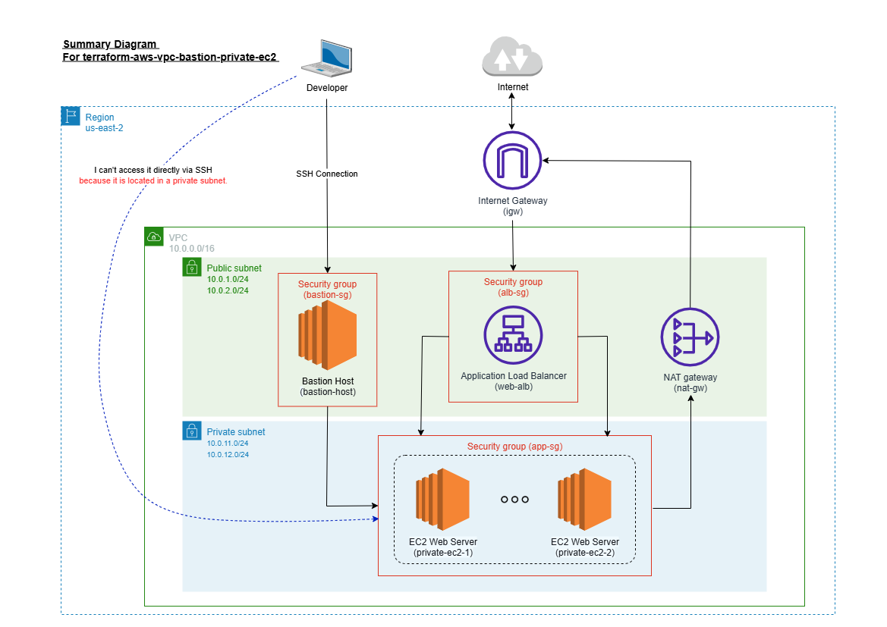

# Terraform AWS VPC with Bastion and Private EC2

This repository contains Terraform configurations to deploy a **secure AWS with Highly Available (HA) architecture** including:



- VPC with public and private subnets
- Internet Gateway and NAT Gateway
- Bastion host in the public subnet (Ubuntu 24.04 LTS)
- Private EC2 instance in the private subnet (Ubuntu 24.04 LTS)
- Nginx web server running on the private EC2
- SSH access via bastion host

## Features
- **Secure access**: SSH to private EC2 only via bastion host
- **NAT Gateway**: Private EC2 can access the internet for updates and packages
- **Ubuntu 24.04 LTS**: Latest long-term support server image
- **Terraform Infrastructure as Code (IaC)**: Fully automated deployment

## Prerequisites
- [Visual Studio Code](https://youtu.be/AJ55GBoixSU) installed
- [Terraform](https://youtu.be/12p3s0gtN_U) installed
- [AWS CLI](https://youtu.be/A1wZ3DeKX8g) installed
- [TeraTerm](https://youtu.be/CyiuLCB2SBU) installed
- AWS CLI configured with IAM credentials
- An AWS account

## Usage
```bash
git clone https://github.com/soeh-tin/terraform-aws-vpc-bastion-private-ec2.git
cd terraform-aws-vpc-bastion-private-ec2

## 🚀 Deployment Steps

**Step 1: Initialize Terraform**

```
terraform init
```

**Step 2: Preview Infrastructure**

```
terraform plan
```

**Step 3: Apply Changes**

```
terraform apply
```
Type yes when prompted.

## ⚙️ Clean Up (optional if you wanna remain the following configurations.)

**To remove all created resources:**

```
terraform destroy
```